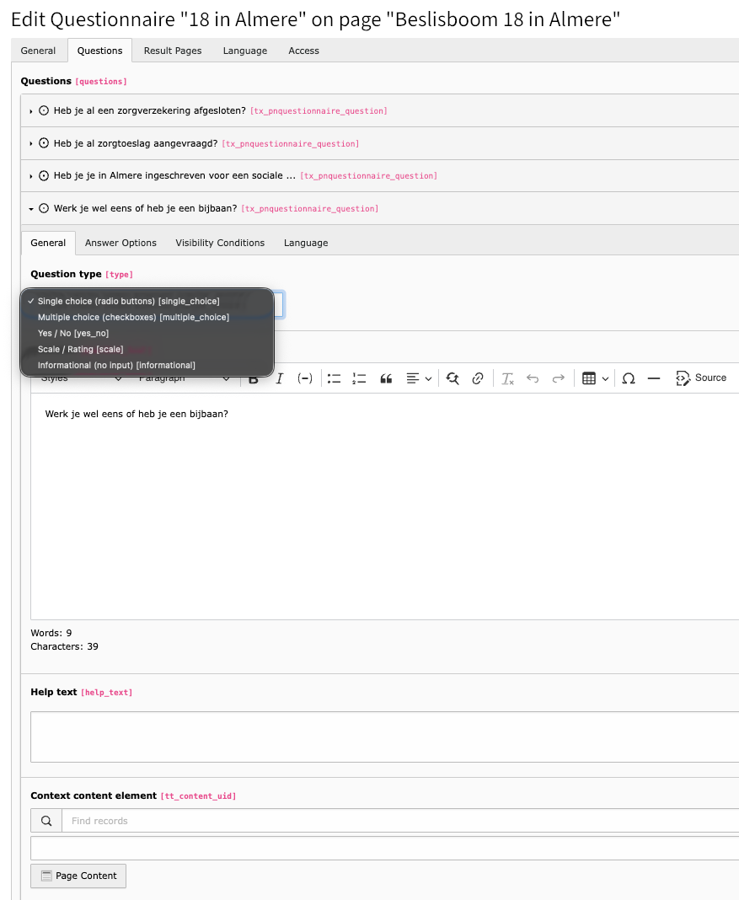
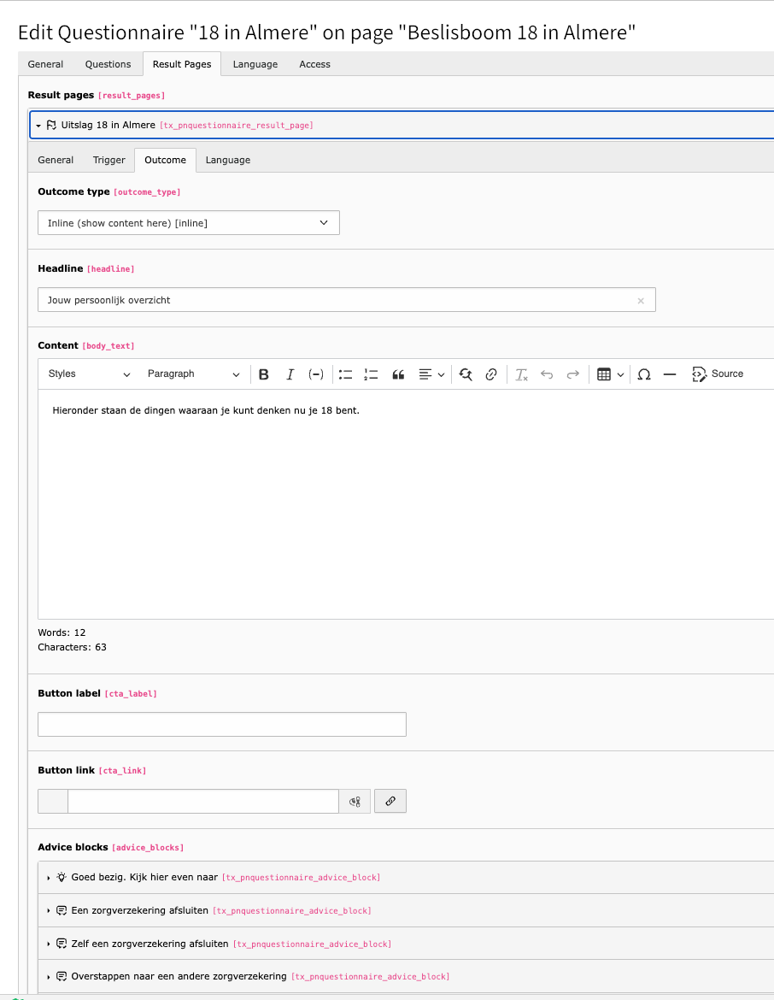
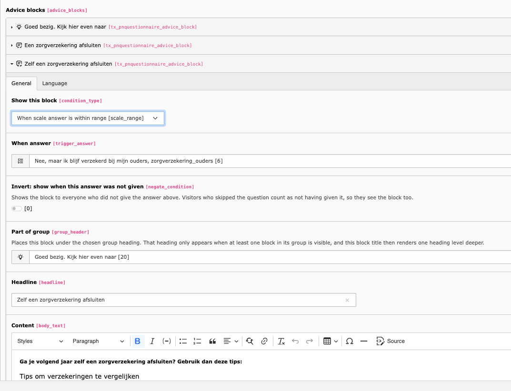

..  _editing:

========================
Building a questionnaire
========================

This chapter explains how to build and manage questionnaires in the TYPO3
backend. No technical knowledge is required.

Concepts
========

..  list-table::
    :header-rows: 1

    -   -   Term
        -   What it is
    -   -   **Questionnaire**
        -   The top-level record that holds everything — questions, settings and
            result pages
    -   -   **Question**
        -   A single step shown to the visitor, one per screen
    -   -   **Answer option**
        -   A selectable choice within a question
    -   -   **Condition**
        -   A rule that shows or skips a question based on a previous answer
    -   -   **Result page**
        -   What happens when the visitor finishes — shown inline or as a
            redirect
    -   -   **Advice block**
        -   An optional content section within an inline result, conditionally
            visible
    -   -   **Score**
        -   A numeric value on an answer option, summed into a total at the end

..  _editing-step1:

Step 1 — Create a questionnaire record
======================================

#.  Open the **List** module and navigate to the folder where questionnaire
    records should be stored. A dedicated sysfolder keeps the list module tidy.
#.  Create a new **Questionnaire** record.
#.  Fill in the **Title**. This is an internal label, never shown to the
    visitor.
#.  On the :guilabel:`Introduction screen` tab, optionally fill in:

    **Introduction text**
        Appears before the first question, above the start button.

    **Text below the start button**
        A closing remark — for instance how long the questionnaire takes, or
        what happens with the answers.

    Both are only shown when the introduction screen is enabled in the plugin
    settings, and both may be left empty.

#.  Save the record.

A questionnaire record carries the standard TYPO3 access fields as well: hide it
to take the questionnaire offline, or set a publish date and an expiry date to
have it appear and disappear on its own. A hidden or expired questionnaire
renders nothing in the frontend.

..  _editing-step2:

Step 2 — Place the plugin on a page
===================================

#.  Edit the page where the questionnaire should appear.
#.  Add a new content element and pick **Questionnaire / Decision Tree** from
    the plugins tab.
#.  On the :guilabel:`Configuration` tab, select the questionnaire record in the
    **Questionnaire** field.
#.  Adjust the remaining settings if needed — see
    :ref:`configuration-flexform`.
#.  Save.

..  note::
    **One questionnaire, multiple pages**

    The same questionnaire record can be placed on multiple pages. Each
    placement can have different display settings — show score, show answer
    summary, own button labels — because those settings live on the plugin
    instance, not on the questionnaire record.

..  _editing-step3:

Step 3 — Add questions
======================

Inside the questionnaire record, open the :guilabel:`Questions` tab and click
:guilabel:`Create new Question`.

    A question record with the :guilabel:`Question type` dropdown open. The
    fields below it change with the type that is chosen.

..  list-table::
    :header-rows: 1

    -   -   Field
        -   Description
    -   -   **Question**
        -   The question text shown to the visitor (supports rich text)
    -   -   **Help text**
        -   Optional short instruction below the question
    -   -   **Context content element**
        -   Optional link to an existing content element — useful for adding an
            image, a video or formatted text as context
    -   -   **Question type**
        -   The answer type — see :ref:`Question types <editing-question-types>`
    -   -   **Required**
        -   Whether the visitor must answer before proceeding
    -   -   **Scale minimum / maximum**
        -   Lower and upper bound of the numeric scale (scale questions only)
    -   -   **Scale display**
        -   Radio buttons or a range slider (scale questions only)

Questions are shown in the order they appear in the list. Drag and drop to
reorder, and hide a question to take it out of the flow without deleting it.

..  note::
    **Informational questions**

    Use the **Informational** type for a screen with text or media but no input
    — an intermediate explanation, or a section break. The visitor just clicks
    Next to continue.

..  _editing-step4:

Step 4 — Add answer options
===========================

For **Single choice**, **Multiple choice** and **Yes / No** questions, open the
:guilabel:`Answer Options` tab of the question and add one option per selectable
answer.

..  list-table::
    :header-rows: 1

    -   -   Field
        -   Description
    -   -   **Label**
        -   The text shown to the visitor
    -   -   **Value**
        -   Internal identifier, used in conditions and result triggers. Use
            something descriptive: `employed`, `yes`, `option_a`
    -   -   **Score**
        -   Optional numeric score, positive or negative, decimals allowed —
            only relevant for score-based results

Drag and drop answer options to reorder them.

..  _editing-step5:

Step 5 — Add conditions (branching)
===================================

A condition makes a question **only visible when a specific previous question
was answered in a specific way**. This is how a decision tree is built. There
are two condition types.

Condition type: Specific answer
-------------------------------

#.  Open the :guilabel:`Visibility Conditions` tab of the question that should
    be conditionally shown.
#.  Click :guilabel:`Create new Condition`.
#.  Set **Condition type** to :guilabel:`Specific answer`.
#.  Select the **Reference question** — the earlier question whose answer
    decides visibility.
#.  Select the **Reference answer** — the answer option that must have been
    chosen.
#.  Save.

Condition type: Scale value
---------------------------

Use this when the reference question is a **Scale / Rating** question and
visibility depends on the number the visitor picked.

#.  Open the :guilabel:`Visibility Conditions` tab.
#.  Click :guilabel:`Create new Condition`.
#.  Set **Condition type** to :guilabel:`Scale value`.
#.  Select the **Reference question**; only scale questions qualify.
#.  Choose an **Operator**: ``>=``, ``<=``, ``>``, ``<`` or ``=``.
#.  Enter a **Value** to compare against.
#.  Save.

For example: show a follow-up question only when the visitor rated satisfaction
``>= 8``.

Multiple conditions
-------------------

A question can have more than one condition. Each condition has an **Operator**
field of its own:

..  list-table::
    :header-rows: 1

    -   -   Operator
        -   Meaning
    -   -   **AND**
        -   This condition must also pass — all AND conditions must be met
    -   -   **OR**
        -   Passing this condition is enough on its own

Conditions are evaluated in the order they appear in the list, top to bottom.
See :ref:`architecture-conditions` for the exact evaluation order.

Rules
-----

-   Conditions can only reference questions that appear **earlier** in the
    questionnaire. Keeping to that is the editor's responsibility; nothing
    enforces it.
-   A question with **no conditions** is always shown.
-   Skipped questions count neither toward the progress nor the score.
-   For a **Scale value** condition: when the referenced question has not been
    answered, the condition fails and the dependent question stays hidden.

Example
-------

..  code-block:: text

    Q1: What is your situation?
        → "Employed"           → show Q2a (work questions)
        → "Self-employed"      → show Q2b (entrepreneur questions)
        → "Looking for work"   → show Q2c (job-seeker questions)

Q2a has one condition: type *Specific answer*, reference question Q1, reference
answer "Employed". Q2b and Q2c work the same way with their own answer.

..  _editing-step6:

Step 6 — Add result pages
=========================

Open the :guilabel:`Result Pages` tab of the questionnaire and click
:guilabel:`Create new Result Page`.

    A result page with outcome type :guilabel:`Inline`. Headline and content are
    shown to the visitor, followed by the advice blocks listed at the bottom.

..  important::
    **Order matters.** Result pages are evaluated top to bottom and the first
    match wins. Place the most specific triggers first and a catch-all last.

Each result page answers two questions: when does it apply, and what happens
then.

..  _editing-triggers:

Trigger — when does this result apply?
--------------------------------------

..  list-table::
    :header-rows: 1

    -   -   Trigger type
        -   When it matches
    -   -   **Catch-all**
        -   Always — use as the last result page, as a fallback
    -   -   **Score range**
        -   When the total score is between score min and max, inclusive
    -   -   **Specific answer**
        -   When the visitor selected a specific answer option, anywhere in the
            questionnaire
    -   -   **Combination**
        -   When both the score range and the specific answer match
    -   -   **Scale answer range**
        -   When the numeric answer for a specific scale question falls within
            the configured range, inclusive

When **Scale answer range** is selected, three extra fields appear: the **Scale
question** whose answer is checked (only scale questions are listed), and the
inclusive **Minimum value** and **Maximum value**.

..  _editing-outcomes:

Outcome — what happens when it applies?
---------------------------------------

..  list-table::
    :header-rows: 1

    -   -   Outcome type
        -   What happens
    -   -   **Inline**
        -   Result content — headline, body text, advice blocks, button — is
            shown within the questionnaire on the same page
    -   -   **Internal page**
        -   The visitor is redirected to a TYPO3 page you select from the page
            tree
    -   -   **External URL**
        -   The visitor is redirected to a URL you enter
    -   -   **Domain record**
        -   The visitor is sent to the detail view of a record from another
            extension: a news article, event, vacancy, ad or activity. Requires
            configuration by a developer, see
            :ref:`Domain record outcomes <configuration-domain-record>`

The fields of an inline outcome:

..  list-table::
    :header-rows: 1

    -   -   Field
        -   Description
    -   -   **Headline**
        -   Result headline
    -   -   **Content**
        -   Main result text (rich text — links can go in here)
    -   -   **Button label**
        -   Call-to-action button text, optional
    -   -   **Button link**
        -   Call-to-action button target, optional
    -   -   **Advice blocks**
        -   Conditional content sections, see :ref:`Step 7 <editing-step7>`

..  tip::
    **Redirects and visitor expectations**

    With **Internal page**, **External URL** or **Domain record**, the visitor
    is silently redirected away from the questionnaire the moment the last
    answer is submitted. They may not understand why they suddenly land
    somewhere else.

    Consider adding an **Informational** question as the very last step, to say
    what will happen next — for example: *"Based on your answers we have found a
    suitable match for you. Click Next to view your result."* That makes the
    redirect feel intentional rather than unexpected.

..  tip::
    **Multiple links in a result?**

    A result page has one call-to-action button. If more links are needed, add
    them as hyperlinks inside the content field.

..  _editing-step7:

Step 7 — Add advice blocks
==========================

Advice blocks are **conditional content sections** within an inline result page.
They show personalised advice depending on the visitor's score or a specific
answer, within the same result. They are only available when the outcome type is
:guilabel:`Inline`.

    An advice block with a **scale answer range** condition, the invert
    checkbox, and a reference to the group heading it belongs under.

..  list-table::
    :header-rows: 1

    -   -   Field
        -   Description
    -   -   **Show this block**
        -   When to show it: Always / Score range / Specific answer / Scale
            answer range / Group heading above other blocks
    -   -   **Score min / max**
        -   Visible score range (score range condition only)
    -   -   **When answer**
        -   The answer that must have been given (specific answer condition
            only)
    -   -   **Invert**
        -   Show the block when the chosen answer was *not* given
    -   -   **Scale question**
        -   The scale question whose value is checked (scale answer range only)
    -   -   **Minimum / Maximum value**
        -   Inclusive range the scale answer must fall within
    -   -   **Part of group**
        -   Places this block under a group heading
    -   -   **Headline**
        -   Block heading
    -   -   **Content**
        -   Block content (rich text)

Advice blocks appear in the order of the list, and only those whose condition is
met are rendered.

..  note::
    **A worked example**

    A result page for everyone with a score of 10–20. Within it:

    -   block A, always shown: the general recommendation
    -   block B, specific answer "I work outdoors": an outdoor tip
    -   block C, score range 15–20: an extra warning for the higher scores
    -   block D, scale answer range, Q3 satisfaction ``>= 8``: a positive
        reinforcement message

Inverting a condition
---------------------

**Invert** turns a *specific answer* condition around: the block appears when
the visitor did **not** choose that answer.

That is useful for advice which only applies to people who skipped something.
Take a question about organ donation with an option "I have already registered
my choice". Attach a block to that option, tick **Invert**, and everyone who did
*not* register gets the reminder — while the people who did are spared a message
that does not apply to them.

..  warning::
    **An unanswered question counts as "not given".**

    If the question is optional, or the visitor never reached it, the answer is
    absent — so an inverted block appears. Whether that is what you want depends
    on the text. A reminder ("don't forget to arrange this") is fine for someone
    who skipped the question. A statement that assumes a situation ("since you
    have not arranged this yet") is not. Make the question **required** when the
    distinction has to be reliable.

..  _editing-advice-groups:

Grouping blocks under a heading
-------------------------------

A long result page reads better in sections. Set **Show this block** to
:guilabel:`Group heading above other blocks` to turn a block into a heading,
then set **Part of group** on every block that belongs underneath it.

What to keep in mind:

-   A group heading has **no condition of its own**. It appears automatically
    when at least one block in its group is visible, and disappears when none
    are. The heading's visibility never has to be maintained by hand.
-   A group heading has **no content** — only a headline.
-   The headline of a grouped block moves **one heading level deeper** than an
    ungrouped one. That matters for the rich text in the body: sub-headings
    inside a grouped block belong on **Heading 5**, not Heading 4. Using the
    wrong level skips a level in the document outline, which screen readers and
    search engines both read as an error. See :ref:`templates-headings` for what
    an administrator has to make available in the RTE.
-   Blocks that are not part of any group keep their normal level and can sit
    before, between or after the groups.

..  _editing-question-types:

Question types
==============

..  list-table::
    :header-rows: 1

    -   -   Type
        -   Input
        -   Use for
    -   -   **Single choice**
        -   Radio buttons — one answer
        -   Most questions
    -   -   **Multiple choice**
        -   Checkboxes — one or more answers
        -   "Select all that apply"
    -   -   **Yes / No**
        -   Two radio buttons, with labels you define
        -   Binary questions
    -   -   **Scale / Rating**
        -   Numbered scale from min to max, as radio buttons or a range slider
        -   Assessments, NPS, ratings
    -   -   **Informational**
        -   No input — a Next button only
        -   Intermediate explanation, section break

Scale questions have a **Scale display** field:

..  list-table::
    :header-rows: 1

    -   -   Option
        -   Description
    -   -   **Range slider** (default)
        -   A draggable slider showing the selected value live. Starts at the
            midpoint of the range when no answer is stored yet
    -   -   **Radio buttons**
        -   Individual numbered radio inputs, one per step in the range

..  note::
    Scale and informational questions are score-neutral — they never add to the
    total score.

Tips and rules of thumb
=======================

Questionnaire structure
-----------------------

-   Start with a **sketch on paper** of the question flow and the possible
    outcomes before building anything in the backend.
-   Use descriptive **internal titles** on questionnaire and result page
    records; the next editor will thank you.
-   Store questionnaire records in a **dedicated sysfolder**.

Conditions
----------

-   Only reference questions that appear **above** the current one in the list.
-   Test the branching by walking through the questionnaire as a visitor —
    condition mistakes are easy to miss in the backend.
-   Use the **Start over** button while testing to reset the session. It only
    appears after the first answer has been submitted.

Result pages
------------

-   Always add a **catch-all** result as the last entry. Without it, a visitor
    who matches no trigger sees an error message.
-   For score-based questionnaires, make sure the score ranges **cover every
    possible total** without gaps.

Scoring
-------

-   Scores can be **positive or negative**: +2 for a healthy choice, -1 for a
    risk factor.
-   The score is only shown to the visitor when
    :ref:`confval-flexform-show-score` is on.
-   Advice blocks with a score condition work whether or not the score is
    displayed.

Reuse
-----

-   The same questionnaire record can be placed on **multiple pages** — useful
    for embedding the same tool in different contexts.
-   Each placement has its own settings, so the score can be shown on one page
    and hidden on another.
