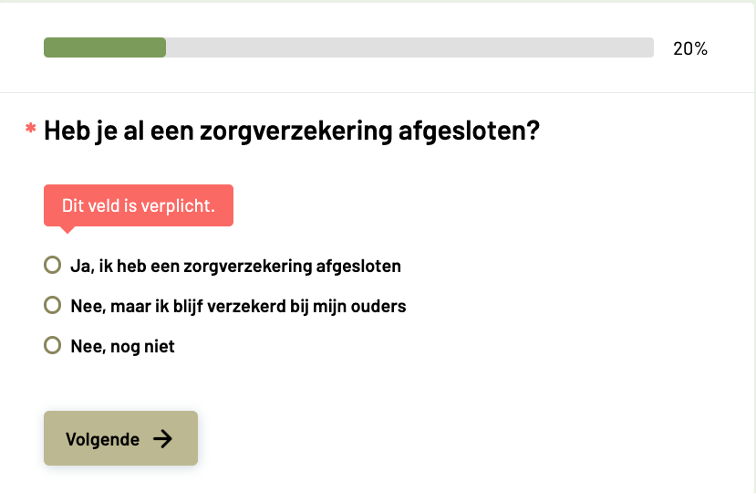
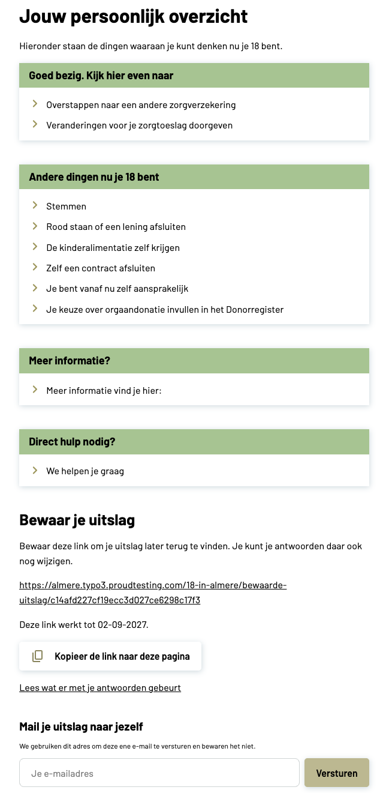

..  _examples:

========
Examples
========

..  important::
    **Style not included.** The extension ships semantic markup with BEM class
    names, not a finished design. Colours, typography, spacing, cards and
    buttons in the screenshots below come from the sitepackage of the site in
    question. Out of the box you get the same structure and behaviour, but
    unstyled.

Answering a question
====================

    A single-choice question with the progress bar in
    :ref:`completed mode <confval-typoscript-progress-mode>` and the
    client-side message for a required question.

What is visible here:

-   The **progress bar** with the percentage beside it. It counts the questions
    already answered, not the one on screen: 20% means one of five questions is
    behind the visitor.
-   The asterisk before the question text marks it as **required**; the message
    below appears when the visitor tries to continue without answering.
-   The three answer options of a **single choice** question, and the
    :ref:`Next button <confval-flexform-button-next>`, whose label can be
    changed per plugin instance.

The result page
===============

    An inline result with :ref:`group headings <editing-advice-groups>`, the
    retrieval link and the mail form — both switched on in the plugin settings.

What is visible here:

-   The result **headline** and body text from the result page record, followed
    by the advice blocks that matched the visitor's answers.
-   Four **group headings**, each with the blocks that belong under it. A
    heading appears only when at least one of its blocks is visible.
-   **Bewaar je uitslag** — the retrieval link, with the date it expires and a
    copy button, plus a link to the privacy statement.
-   **Mail je uitslag naar jezelf** — the mail form. The address is used for
    that one mail and is not stored.
